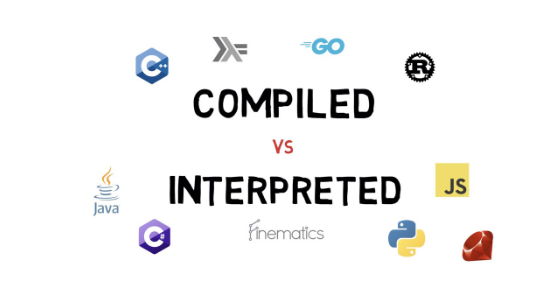

# <p style='color:#FFEB29'>Dasturlash</p>



## Compiled Dasturlash tili

### ℹ️ Compiled(Compilyatsiya qilinadigan) tiliarini ishlashi bu barcha yozilgan codelarni jamlab keyin ishga tushiradi,buni afzailigi va tezligi bunda yozilgan dasturlarni computer to'g'ridan to'g'ri tarjima qiladi (execute) machine codega ogiradi shu sababli compiled tillari tez hisoblanadi

### ℹ️ Interpreted(tarjima qilinadiga) ishlash prinsipi tepadan pastga va chapdan onga oqib dasturi yurgiziadi,interpreted dasturlash tili unga tarjimon kere boladi u to'g'ridan to'g'ri tarjima qimidi yozilgan dasturni, unga interpretator dasturi kere bo'ladi va dasturni machine codiga ogiriadi

### Python-interpretatori u python codeni ketma ketlikda machine code o'giruvchi dastur

### Variables(O'zgaruvchilar)

- koplab dasturlash tilargia qaraganda pythonda variable yaratvotganda unga(variable type) oldindan belgilash shart emas
- Variable saqlanadigan value holagan turda(type)bo'lishi mumkun
- Variablelar ozgarishi mumkun bo'lgan bir qiymatni ozida saqlab turuvchi container

### Int(Integer)-Type deb butun son tushuniladi manfy yo musbat

### Float-bir yoki bir nechta kasr qismini oz ichiga olgan musbat yoki manfiy sondir ! floatda arifmetik amalar bajarvotganda floatinpoint bergani sabab notogri qiymat beradi

### Decimal- Onlik kasrdan iborat qiymatlarni aniq ifodalash va arifmetik amalardan aniqroq ifoda olish uchun ishklatiladi - masalan pullar bilan ishlashda 1.20 cent

```python
    # float vs decimal
    from decimal import Decimal
    floatres = 0.1 + 0.2 # 0.30000000004 error

    decimalres = Decimal('0.1') + decimal('0.2') # 0.3
```

## 💡 Dasturlar ikkita muhim qismdan iborat birinchisi malumot turlari ikkinchisi esa u malumotlar ustidegi ammalar va algoritmlardan iborat
